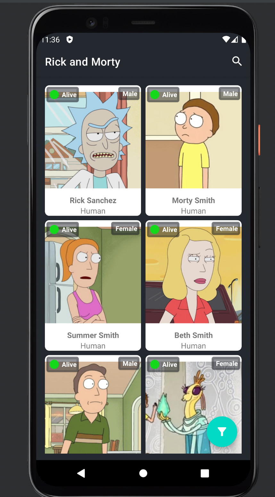
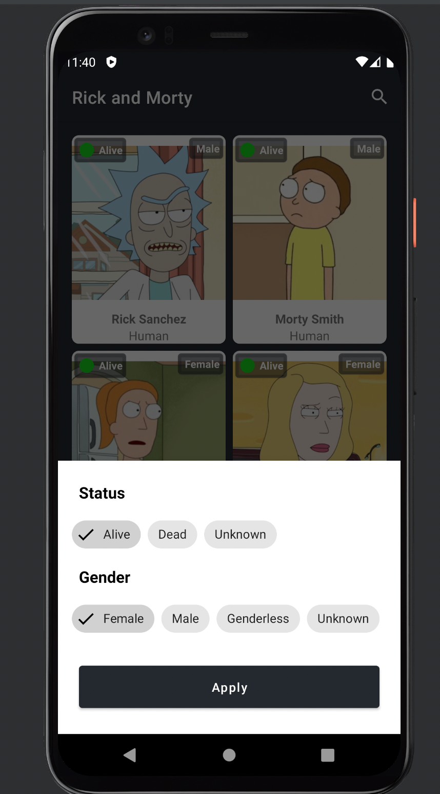
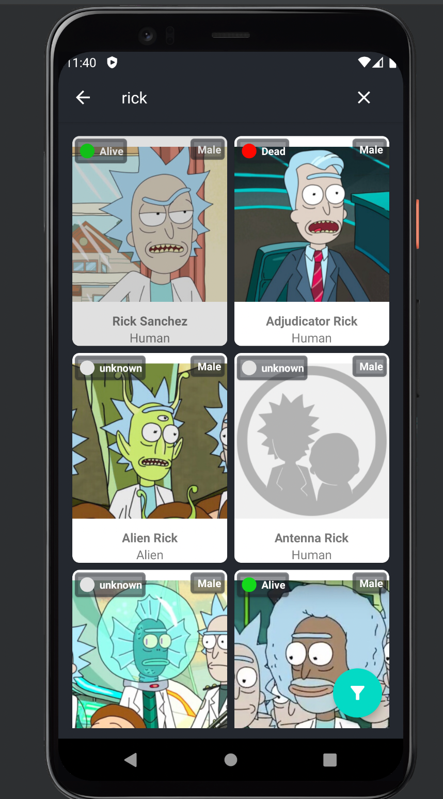
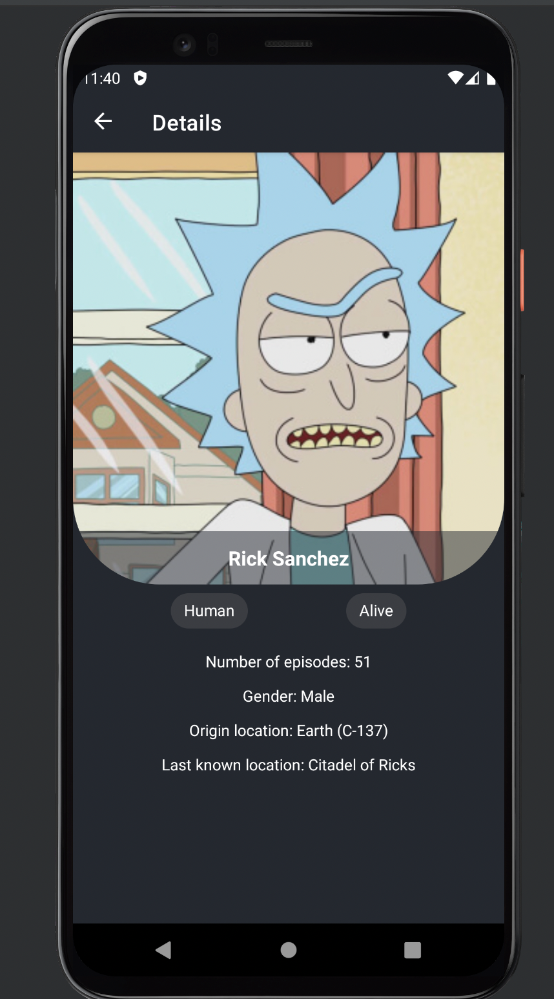

<h1 align="center">Rick And Morty</h1>

<p align="center">
  <a href="https://opensource.org/licenses/Apache-2.0"></a>
</p>

<p align="center">  
This is a basic Android application that shows [Rick and Morty](https://rickandmortyapi.com/) characters and their details, based on mvvm architecture.

</p>

<p align="center">
  
  
  
  
</p>


## Tech stack
* ✅ Clean Architecture
* ✅ Repository pattern
* ✅ MVVM
* ✅ Navigation Component
* ✅ Safe-Args
* ✅ Glide
* ✅ Livedata
* ✅ ViewModel
* ✅ Navigation Component
* ✅ Retrofit
* ✅ Koin
* ✅ Kotlin Coroutines
* ✅ Motion Layout

## Apk
You can also see and download apk file by [this link](https://github.com/ytam/RickAndMorty/tree/main/app/dev/release/rickandmorty.apk).

## MAD Score 👇


# License
```xml
Designed and developed by 2021 ytam

Licensed under the Apache License, Version 2.0 (the "License");
you may not use this file except in compliance with the License.
You may obtain a copy of the License at

   http://www.apache.org/licenses/LICENSE-2.0

Unless required by applicable law or agreed to in writing, software
distributed under the License is distributed on an "AS IS" BASIS,
WITHOUT WARRANTIES OR CONDITIONS OF ANY KIND, either express or implied.
See the License for the specific language governing permissions and
limitations under the License.
```

