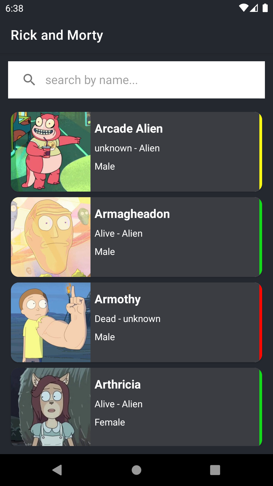
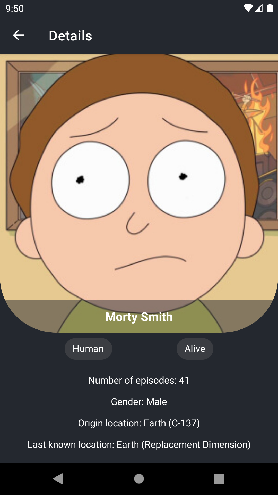

# RickAndMorty
This is a basic Android application that shows [Rick and Morty](https://rickandmortyapi.com/) characters and their details, based on mvvm architecture.

## Apk 
You can also see and download apk file by [this link](https://github.com/ytam/RickAndMorty/blob/main/rickandmorty.apk).

## Tech stack
* Clean Architecture
* Repository pattern
* MVVM
* Navigation Component
* Safe-Args
* Glide
* Livedata
* Viewmodel
* Navigation Component
* Retrofit
* Koin
* Kotlin Coroutines
* 

## Screenshots 📱
 

  
  

## MAD Score 👇

